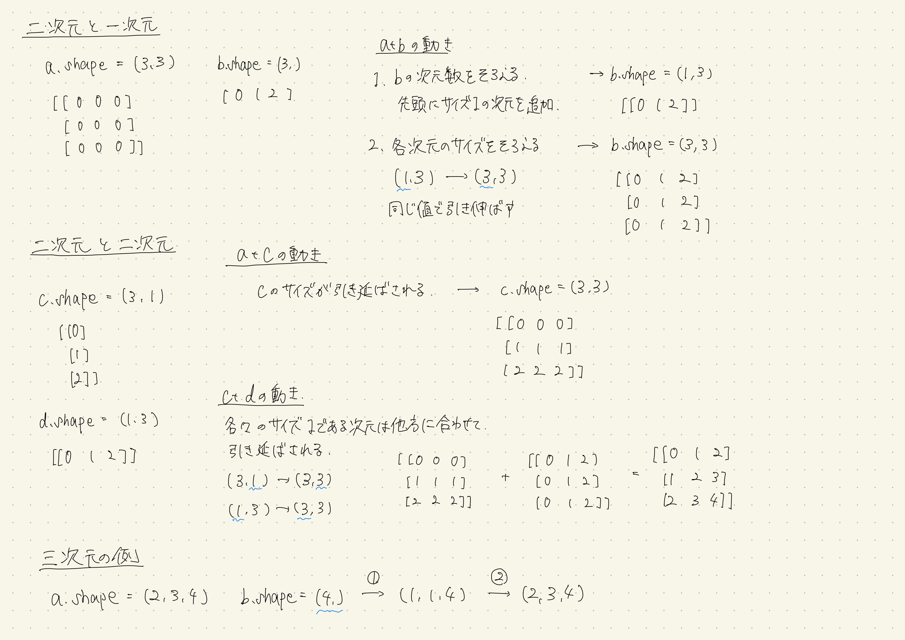
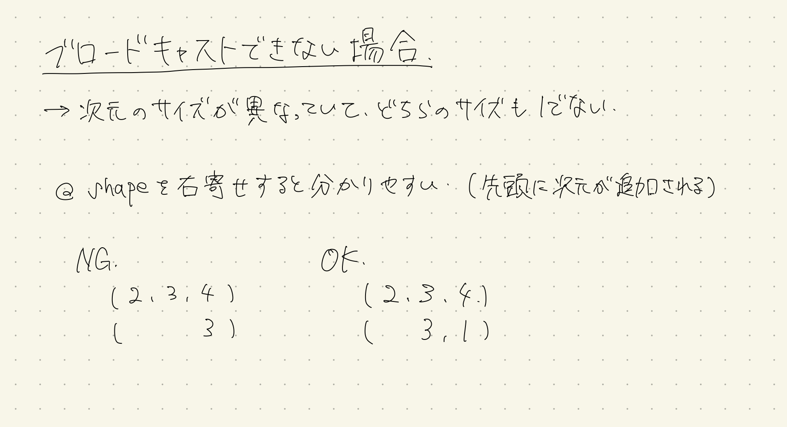

# numpy broadcastについて

[参考ページ](https://note.nkmk.me/python-numpy-broadcasting/)

配列のサイズが違っても自動で計算してくれる`numpy`の機能で小さい配列が大きい配列に「合わせて」広がる。

## ブロードキャストのルール
1. 次元数を揃える
   - 2つの配列の次元数が異なる場合、次元数が少ない方の配列の先頭にサイズ（長さ）が1の新しい次元を追加して次元数を揃える。
2. 各次元のサイズ（長さ）を揃える
   - 2つの配列の各次元のサイズが一致しない場合、サイズが1である次元は他方の配列の次元のサイズに引き伸ばされる（値が繰り返される）。
   - 2つの配列のどちらのサイズも1ではない次元が存在するとブロードキャストできずにエラーとなる。


## 次元を揃えてから比べる
1. 次元の数が違う時は、形が合うように1を補って比べる
2. 各次元ごとに「同じ数字か、どちらかが1ならOK」

たとえば、、、
```py
a.shape = (3, 1)
b.shape = (3,)
```
この時、bのshapeの次元に1を追加して`b.shape = (1, 3)`にする

### 具体例



<div style="text-align: center;">
  
</div>

## ブロードキャスト結果を取得する関数

`np.broadcast_to()`を使う  
ブロードキャストができるかは上と同じ

```py
a = np.arange(3)
print(a)
# [0 1 2]

print(a.shape)
# (3,)

print(np.broadcast_to(a, (3, 3)))
# [[0 1 2]
#  [0 1 2]
#  [0 1 2]]

print(type(np.broadcast_to(a, (3, 3))))
# <class 'numpy.ndarray'>
```